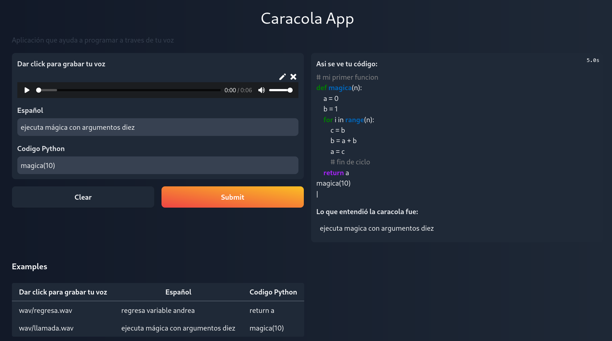

# Caracola Mágica

## Equipo: Los panchos
- Fernando Santa Rita Vizuet ([@FSRV24](https://github.com/FSRV24) )
- Fernando Avitúa ([@FunkySpiderman](https://github.com/FunkySpiderman) )
- Guillermo Andrés ([@gandres-dev](https://github.com/gandres-dev) )

La **Caracola Mágica** es una aplicación para la escritura de código en Python vía voz desarrollada como proyecto para el *Hackatón sobre tecnologías del habla* donde se emplea un modelo pre-entrenado en español de [Hugging Face](https://huggingface.co/patrickvonplaten/wav2vec2-large-xlsr-53-spanish-with-lm). Dicho modelo permite la transcripción de una entrada de audio en español a texto.

## Guía de inicio

Para hacer uso de la aplicación se tiene que clonar el repositorio y seguir los siguientes pasos:

1. Abrir el archivo `/notebooks/app.ipynb` desde Google Colab desde el folder de Notebooks. 

2. Cambiar la ruta de Google Drive a la ruta del usuario que lo ejecuta.

3. Ejecutar el archivo. (Nota: hay que correr toda la libreta, después reiniciar el kernel y correr todo de nuevo).

4. Abrir el link que provee el programa para acceder el servidor que creado (válido por 72 horas).

5. Dicta alguno de los comandos básicos disponibles para Python o selecciona algunos de los ejemlos propuestos.

## Algunos ejemplos de uso

Seguidos los pasos de la guía de inicio, aparecerá la interfaz mostrada anteriormente.

En la parte superior izquierda se encuentra el botón *Dar click para grabar tu voz*, que permite al usuario grabar una línea de código a la vez. Al terminar de grabar la línea de código, el usuario debe detener la grabación y presionar el botón *submit* la Caracola Mágica hará la interpretación.

En la parte inferior de la página se encuentran las instrucciones para programar por voz la famosa *función de Fibonacci*. Dando click en cada uno de los enunciados tenemos la posibilidad de acceder a audios pre-grabados con las instrucciones indicadas para dicha línea de código. Este audio puede mandarse directamente al programa o tomarse como referencia para grabar su propio audio.

### Diccionario fonético para el uso de variables de una letra

Para el uso de variables que incluyan una letra se encuentran problemas con el modelo, pues no reconoce correctamente estas en las mayoría de los casos. A continuación se lista el diccionario fonético implementado:

- andrea -> a

- bravo -> b

- carlos -> c

- delta -> d

- eduardo -> e
                    
- fernando -> f
                    
- garcia -> g
                    
- hotel -> h
                    
- india -> i
                    
- julieta -> j
                    
- kilo -> k
                    
- lima -> l
                    
- miguel -> m
                    
- noviembre -> n
                    
- oscar -> o
                    
- papa -> p
                    
- queretaro -> q
                    
- romero -> r
                    
- sierra -> s
                    
- tango -> t
                    
- uniforme -> u
                    
- victor -> v
                    
- wafle -> w
                    
- equis -> x
                    
- yarda -> y
                    
- llarda -> y  
